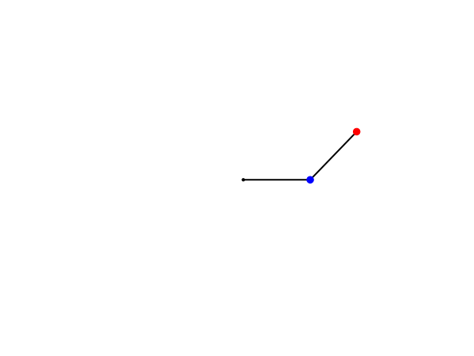

# A Double Pendulum!

This repo hosts a custom RK4 solver, a 1st order system for the dynamics of the pendulum derived using the Lagrangian approach, and some visualization code to see the motion of the pendulum.  

TODO: Dervive the equations of motion via the Udwadia-Kalaba approach.

